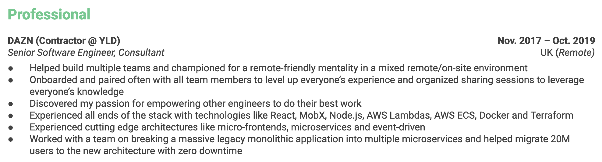
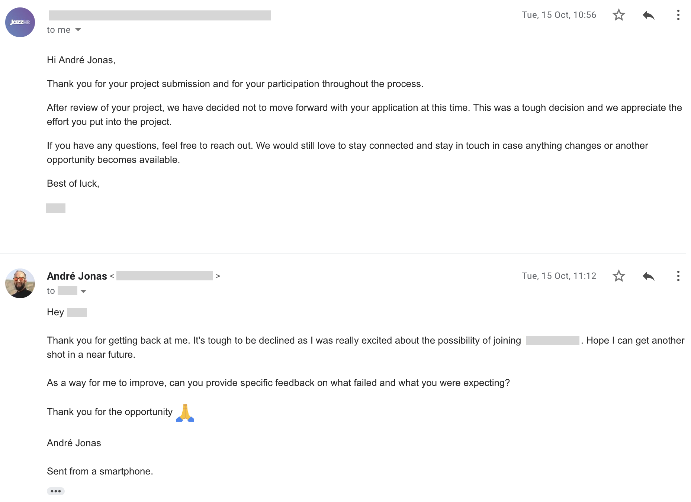

Back in late 2019 I was let go from my old job and got [back on the job market](https://twitter.com/andrezzoid/status/1194269919476621312). Mind you this was before the 2020 pandemic started spreading throughout the entire world and forcing companies to resort to remote work. At that point I was already working remotely for 5 years and I knew how hard it would be to find a remote-first environment where I could grow and help others grow.

To my surprise, looking for a job at that time was a tremendous learning experience. It’s incredible how many companies are hiring remotely these days and how much easier it is to find them and interview with them then it was all those years back when I first started working remotely. If you are hiring remotely or looking for a remote job, I salute you! 🍺

In the following 2 months I've applied to remote positions with over 10 companies hiring remotely such as 1Password, Doist, DuckDuckGo, Elastic, Typeform, Webflow and others, and I've been very fortunate to be able to stand out to most of these companies and get the chance to interview with them. Now I would like to distill the approach I took so you can profit from my experience.

## Understand the current reality

Applying to a remote position is pretty much the same as applying for any other kind of position (feel free the apply the same principles in this post) except for one thing: **The odds are greatly against you!**

> https://twitter.com/amix3k/status/1227575310339710978

Good remote or distributed companies can hire anywhere in the world and tend to receive hundreds or thousands of applications per role. As a result it gets orders of magnitude harder for an individual to get noticed.

Now I'm not saying this to demotivate you, quite the contrary! You must know this to understand the level of effort you need to put in when applying. Keep reading 👇

## More isn't necessarily better

So how can you stand out when you're competing against so many other qualified individuals across the globe? One would be easily excused to think the answer lies in sending as many resumes as possible and see where the ball lands but in reality this often leads to generic, low-quality submissions that may not even fit the position criteria.

The goal here is twofold:

1. **Submit fewer applications** by filtering only the positions you would fit the best and would interest you the most.
2. **Create consistently high-quality, personalized submissions** that focus on those companies and positions and the value you can bring to them.

Both goals are intrinsically connected to how well you know the company, the kind of people in the company and the position you're applying to.

## Know the company

Think about this for a second: when looking for a job or getting reached out about one it's easy to get lost on tangible attributes such as the technological stack or agile methodologies the company uses or the ability to work remotely, so when asked the _cliché_ question "why do you want to work with us?" people tend to attribute their interest to those features. Imagine how many times someone at GitLab must hear "I want to work at GitLab because I like to work remotely". It's not very fascinating, is it?

On the other hand, work for a company long enough and you'll justify the same question with more intagible attributes such as your love for the company's product, goals, mission or culture, the emotional intelligente of your coworkers or your team dynamics. Why? Because you've worked there long enough to get to know it all. Wouldn't it be great if you could get to know some of these things before applying and save yourself and the company a lot of time?

Knowing the company you're applying to is not meant to massage their ego, it's meant for you to understand why would you want to work with them, if the company shares your values, what can you bring to the table and how can the company advance your career. As an added benefit, knowing the company you’re applying to shows them that you care about where they’re coming from and what they’re trying to accomplish.

Make an effort to know the company, their product or services, their history, goals, mission, culture and how is it like working remotely with them. Check out the company's website, blog, Twitter account, podcasts, you name it. Get in touch with a manager who works there or someone in the team you're applying to (Twitter DM's are great for that) and ask them questions about the company. A lot of these people are actually quite open to talk (that in itself says a lot about the company).

As a small example of knowing a company and a product at a personal level, I've been following [Protonmail](https://protonmail.com/) for a while and I know they hire remotely. However, I've only applied for a position with them after turning into a paying customer and trying out their product for real. Only then have I truly felt in sync with what they're trying to accomplish.

## Show them your path

_Curriculum Vitae_ is a Latin expression that translates to "the course of life", meaning it's meant to be a written expression of someone's life work. Unfortunately updating the CV, or resume, has turned into a mundane task most of us do without giving it a second thought. No more!

Stop using your resume as a breadcrumb trail for what companies you have worked for or technologies you have used in the past and use it instead to show the direction your career has taken. Take advantage of this medium to show how you've created an impact at your previous jobs, how you've grown with each experience, what you're most proud of and more.

The general rule of thumb for updating your resume should be: **less keywords, more meaning.**

I've been called for intervews a lot more often since started paying more attention to how my resume is written but the greatest outcome is one I wasn't expecting at all: **how much more meaningful interviews tend to be.** Instead of a boring "So I see here you've used Node.js, that's good", I often get a fully hyped "I'm fascinated about how you've helped your team migrate a 20 million users service with zero downtime, can you tell me that story?"

## Write them a letter

Most remote opportunities require or encourage you to write a cover letter to go with the resume. This is yet another opportunity for you to stand out with a personal touch, do not pass on it nor screw it up by using a generic cover letter for every company. This step is so important you should try to submit it somehow even when it's not required!

An impressive cover letter builds on the knowledge you have acquired about the company and the desired position to answer the following questions:

1. **Who are you?** Present yourself with empathy and show the side of yourself the company is looking for.
2. **Why do you want this position?** This is yet another place where you can profit from your knowledge about the company. If possible, create a relation between your goals and what the company is doing.
3. **What can you bring to the table?** Talk about your past work, how you've overcome difficulty. Tell a story.

As a practical example, [my cover letter to Doist](2020_01_24_doist_cover_letter.pdf) is one of my favorite, most likely one of the best I've written so far. I guess it helps that they have a submission form with fixed questions instead of letting you write freely. I got shortlisted because of my CV and cover letter but ultimately failed the interview process because I didn't provide enough work samples. As an exercise for you, try and find out where I'm answering each of the 3 questions in the cover letter.

You should also write your cover letter in a way that makes it possible to infer other traits about yourself. One such example are your **communication skills.** Expressing yourself confortably in writing form and adapting your language to the situation and the company is invaluable for working remotely.

## It's ok when it doesn't work

You have been rejected or haven't heard back from the company, I understand how it feels. I have been rejected many, many times. Don't let your ego suffer, you and the company simply were not a good fit at that time and that's ok! In the words of the Stoic emperor Marcus Aurelius:

> “Choose not to be harmed — and you won’t feel harmed. Don’t feel harmed — and you haven’t been.”

Let's instead focus on how to better stand out next time and the only way to do it properly is by gathering feedback, so write back to that rejection e-mail and:

1. **Be kind:** Can't stress this enough, you being rejected was nobody's fault so be kind to whoever is on the other side and thank them for their time.
2. **Ask for feedback:** This is the only way you'll ever improve -- by understanding what were the company's expectations. Not every company will be able or willing to provide individual feedback but it doesn't hurt to ask. Again, remember to be kind!
3. **Don't react to feedback given:** If you actually get feedback, remember that this was an expectation from the other side so don't take it too personally. Instead try to take something new and use it in your next round of submissions! As a rule of thumb, **resist the temptation to reply back.**

In the image below and after a very interesting test project, I was rejected by DuckDuckGo without any reason why, so I wrote back, kindly asking for feedback. Fortunately they wrote back and I learned about what failed. I might give DuckDuckGo another try later and I guarantee I'll do a lot better next time!

---

I hope overall this post gives you extra motivation to pursuit remote opportunities and the tools to do it the right way. The remote work landscape is growing a lot, eventually propelled by the Coronavirus pandemic, with more companies offering the flexibility to work from anywhere and more people pursuing a calmer lifestyle outside the big cities.

My guess is that most people don't go through this length of effort so learn from my experience, follow the advice in this article and you'll have a better chance to get noticed than most. And please share what you have learned so others can do it too 🙏.