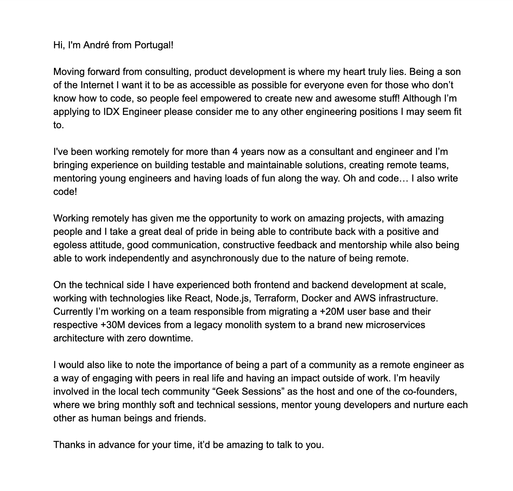

Being [back on the job market](https://twitter.com/andrezzoid/status/1194269919476621312) has been good practise and a tremendous learning experience. It’s incredible how many companies are hiring remotely these days and how much easier it is to find them and interview with them then it was all those years back when I got my first remote gig. If you are hiring remotely or looking for a remote job, I salute you! 🍺

In the last 2 months I have applied to remote positions with some great companies hiring remotly such as 1Password, Elastic, DuckDuckGo, Webflow and others, and I've been so fortunate to be able to stand out to most of these companies and get the chance to interview with them. Of course some of them rejected me at some point in the hiring process, some of them got rejected by me at some point and a couple of them haven't replied so far. And that's ok.

I haven't yet found the right place for me but in the meantime I would like to distill my approach in applying to these position so others can profit.

## Understand the current reality

Applying to a remote position is pretty much the same as applying for any other kind of position (feel free the apply the same principles in this post) except for one thing: The odds are greatly against you!

> https://twitter.com/amix3k/status/1227575310339710978

Remote or distributed companies can hire anywhere in the world and tend to receive hundreds or thousands of applications per role. As a result it gets levels of magnitude harder for an individual to get noticed.

Now I'm not saying this to demotivate you, quite the contrary! Keep reading 👇

## More isn't necessarily better

So how can you stand out when you're competing against so many other qualified individuals across the globe? One would be easily excused to think the answer lies in sending as many resumes as possible and wait to see where the ball drops. This often leads to generic, low-quality submissions that may not even fit the position.

The trick here is twofold:

1. **Submit fewer applications** by filtering only the positions you would fit the best and would interest you the most.
2. **Create consistently high-quality, personalized submissions** that focus on those companies and the value you can bring to them.

I'm leaving the first item to you, take some time to think about what you want to pursue in your life. Meanwhile let's focus on the second item.

## Know the company

Knowing the company you're applying to is not meant to massage their ego, it's meant for you to understand why would you would want to work with them, if you share the company's values, how can you add value to the business and how can the company advance your career. As an added benefit, knowing the company you’re applying to shows them that you care about where they’re coming from and what they’re trying to do.

If you're still not convinced think about this:

> When looking for a job or getting reached out for one it's easy to focus on more tangible attributes such as the technological stack and agile methodologies the company uses or the ability to work remotely. So when asked the _cliché_ question "why do you want to work here?" people tend to attribute their interest to those features. On the other hand, when working for a company long enough one tends to answer the same question with more intagible attributes such as the alignment with the company's product, goals, mission or culture, the emotional intelligente of their coworkers or the team dynamics.

Why is that? Because the employee has worked there long enough to understand the company, the mission, the culture, the people. Wouldn't it be great if you could know it all before applying and save yourself and the company a lot of time?

Make an effort to know the company, their product or services, their history, goals, mission, culture and how is it like working remotely with them. Check out the company's website, blog, Twitter account, podcasts, you name it. Get in touch with someone who works there (Twitter DM's are great for that) and ask them questions about the company.

As an example of knowing a company and a product at a personal level, I've been following [Protonmail](https://protonmail.com/) for a while and I know they hire remotely. However, I've only applied for a position with them after turning into a paying customer and trying out their product for real. Only then have I truly felt in sync with what they're trying to accomplish.

## Show them your path

_Curriculum Vitae_ is a Latin expression that translates to the "course of life", meaning it's meant to be a written expression of someone's life work. Unfortunately updating the CV, or resume, has turned into a mundane task most of us do without giving it a second thought. No more!

Stop using your resume as a breadcrumb trail for what companies you have worked for or technologies you have used in the past and use it instead to show the direction your career as taken. Take advantage of this medium to show how you've created an impact on your previous jobs, how you've been impacted, what you're most proud of and more.

The general rule of thumb for updating your resume should be: **less keywords, more meaning.**

**Offtopic:** I've been called for intervews a lot more often since started paying more attention to how my resume is written but the coolest unexpected outcome I've noticed is actually how much more meaningful interviews tend to be. Instead of being asked "So I see here you've used Node.js at your last job but what have you done?" I'm often asked instead "Please tell me more about how you've helped migrate 20 million users with zero downtime"

## Write them a letter

Most remote opportunities require a cover letter to go with the resume. This is yet another opportunity for you to stand out with a personal touch, do not pass on it or screw it up by using a generic cover letter. Try to submit it somehow even when it's not required.

An impressive cover letter builds on the knowledge you have acquired about the company and position you're applying to (read the ["Know the company"](http://localhost:8000/blog/nailing-remote-work-interviews-part-1-applying/#know-the-company) section) to answer the following questions:

1. **Who** are you?
2. **Why** do you want this position?
3. **What** can you bring to the table?

// TODO: An example of a cover letter I've sent

// TODO: How that checks the items above

// TODO: How cover letters are also great to evaluate communication skills and social profile

<!--// In order to make it memorable you can show how you know their product, what you're expecting to see next and how you could help make it real

// It's not always possible to create a fully custom letter

The following example is the cover letter I sent to [Webflow](https://webflow.com/) when applying to an iDX (internal developer experience) position.

// Turn this into a "Don't worry if you think you're not good enough, you'll get better over time. If I had to rewrite this again it would be something like:"

If you look past the cheesy lines (😅) you'll notice the following information by paragraph:

- **First paragraph --** Why I want to work at Webflow.
- **Second and third paragraph --** The experience I'm bringing to the table.
- **Fouth paragraph --** The technical expertise I'm bringing.
- **Fifth paragraph --** A note intended to show a little humanity and a desire to help and mentor others, which is one of my professional goals.

I admit I could have done a lot better with this cover letter, it's hardly memorable. Some of it feels generic and even derived from the CV, so I gave it another shot at writing a more memorable one. This is what I came up with:

A cover letter opens another, less obvious opportunity -- **to showcase your communication skills.** Communication is one of the most important skills for any job, even more so in remote companies where the main form of communication is through writing. No doubt you'll be evaluated by the ability to express yourself in writing effectively. -->

## It's ok when it doesn't work

You have been rejected or haven't heard back from the company, I understand how it feels. I have been rejected many, many times. Don't let your ego tell you "I knew this wouldn't work" or "what's wrong with me?". You and the company simply were not a good fit and that's ok! Think instead how to better stand out next time and the only way to do it is by gathering feedback, so write back to that rejection e-mail and:

1. **Be kind --** Can't stress this enough, you being rejected was nobody's fault so be kind to whoever is on the other side and thank them for their time.
2. **Ask for feedback --** This is the only way you'll ever improve -- by understanding what were the company's expectations. Not every company will be able or willing to provide individual feedback but it doesn't hurt to ask. Again, remember to be kind!
3. **Don't react to feedback given --** If you actually get feedback, remember that this was an expectation from the other side so don't take it too personally. Instead try to take something new and use it in your next round of submissions! As a rule of thumb, resist the temptation to reply back.

