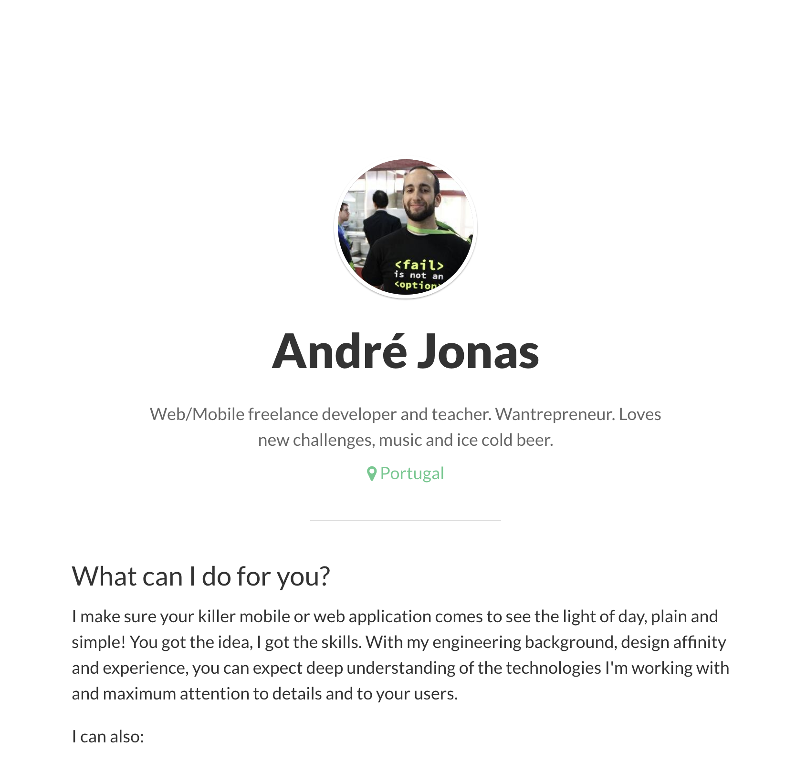

My personal website was in dire need of a change. I still liked the design if we consider it goes 
back to 2015 and I liked how it was a simple landing page. I didn't like the copy so much, it felt 
braggy. I like to think 2019 André knows better. But most of all I think it wasn't helpful. It 
should be a gateway to present myself, to share ideas, to spur discussions, to make 
myself available for the community and to help others.

It just so happens I have a lot of free time right now and quickly jumped into rebuilding it from 
scratch with [Gatsby](https://www.gatsbyjs.org/) and [TailwindCSS.](https://tailwindcss.com/) What a 
blast!

## Why Gatsby?

First of all there are a lot of amazing [static site generators](https://www.staticgen.com/) 
available in the [JAM Stack](https://jamstack.org/) space and you should at least look closely to 
the top 5 and understand where they differ and how that could fit your needs. For me there wasn't 
one clear reason for choosing Gatsby but a set of them:

1. React really fits my mental model for designing applications and allows me to re-use components 
even in the smallest of designs (like this one)
2. Gatsby has a huge ecossystem of plugins for pretty much everything which saved me loads of work, 
tweaks and optimizations
3. The ability to use GraphQL with Gatsby to query and transform data from sources lets me pull my 
blog posts in Markdown from the website's repository but gives me the flexibility to change 
configuration to pull content from other sources at any given time (eg. I may want to start writing 
to [Dev.to](https://dev.to/) and use [gatsby-source-dev](https://github.com/geocine/gatsby-source-dev) 
to pull content from this source)

Gatsby's plugin ecossystem is truly amazing, I've used plugins for such things as:
+ Pull markdown files, parse and turn them into Blog pages
+ Optimize image format, quality and resolution by exposing the same image at multiple sizes to 
provide close to optimal image size for every device size/resolution, while also using clever tricks 
like [progressive image loading](https://jmperezperez.com/medium-image-progressive-loading-placeholder/) 
or using a container to hold the size of the image and avoid layout jumps - these are all very 
expensive optimizations to do on your own time!
+ Creating an RSS feed
+ Lazy loading other pages of the website for near realtime feel and offline support
+ Analytics

Gatsby also provide [Starter](https://www.gatsbyjs.org/starters/?v=2) sites already pre-configured 
for different use cases to give you a head start. I've started with 
[gatsby-starter-blog](https://github.com/gatsbyjs/gatsby-starter-blog), although I've changed quite 
a few things it did save me plenty of time.

## Why TailwindCSS?

I needed some help in the design department. I didn't want to invest too much time experimenting 
with different sizes, spacings or colors but still wanted the flexibility to create something that 
felt unique.

TailwindCSS provides low-level utility classes that let me build my custom design while also 
offering nice design guidelines like font sizes, widths, breakpoints and others. Again there are 
plenty of choices in this space (also recommend [Tachyons](https://tachyons.io/)). I've ended up
choosing Tailwind for it's ability to be configurable and customizable, it wasn't required right now
but gives me that flexibility in the future.

One thing I liked with Tailwind and MDX, the Markdown parser for my blog posts, was 
defining classes for each markdown element like titles, paragraphs or code. Have a look in the [source code](https://github.com/andrezzoid/andrezzoid.github.io/tree/master/src/components/mdx.js).

## If you liked it...

If you want to create a website or blog with Tailwind and don't know exactly how to start, I've created a [gatsby-starer-blog-tailwindcss](https://github.com/andrezzoid/gatsby-starter-blog-tailwindcss) (check the demo [here](https://gatsby-starter-blog-tailwindcss-demo.netlify.com/)) starter for you to use. Let me know how you've used it!
